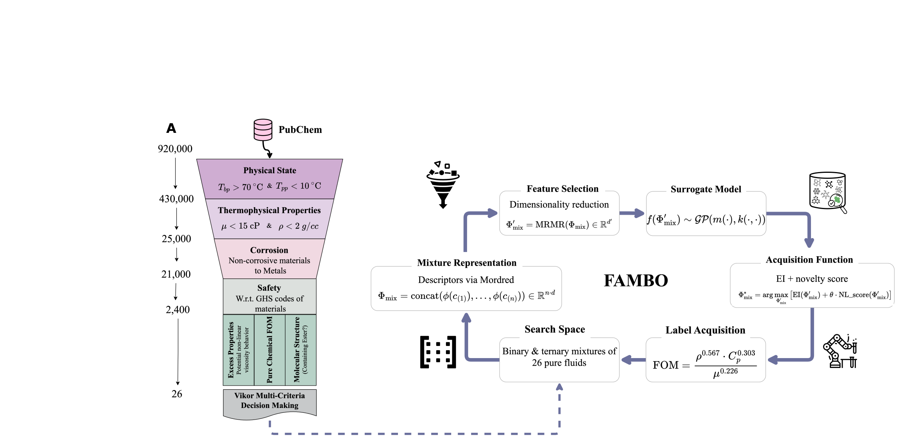

# Self-Driving Discovery of Electric Vehicle Coolants

<p align="left">
  
</p>

This repository implements a **self-driving laboratory (SDL)** framework for the discovery and optimization of electric vehicle (EV) coolant mixtures.

The platform combines:

- Automated search-space construction  
- Machine learning surrogate modeling  
- Feature Adaptive Bayesian Optimization (FABO)  
- Autonomous experimental updating  
- Mixture non-linearity handling  

The goal is to autonomously propose high-performance coolant mixtures within a closed-loop optimization framework.

---

## Repository Structure

```
.
├── data/
│   ├── compounds.csv              # Required: pure component metadata
│   └── train_data/                # Optional: hot-start dataset
│
├── notebooks/
│   └── main.ipynb                 # Demo notebook (recommended entry point)
│
├── src/
│   ├── __init__.py
│   ├── BO.py                      # Core Bayesian Optimization engine
│   ├── feature_selection.py       # Feature selection methods
│   ├── search_space_init.py       # Search space construction
│   └── sdl.py                     # Self-driving optimization loop
│
├── requirements.txt
└── README.md
```

---

## Installation

### 1. Clone the repository

```bash
git clone <repo-url>
cd <repo-folder>
```

### 2. Create environment (recommended)

```bash
conda create -n evcoolants python=3.10
conda activate evcoolants
```

### 3. Install dependencies

```bash
pip install -r requirements.txt
```

---

## Quick Start (Demo)

The recommended entry point is:

```
notebooks/main.ipynb
```

From the repository root:

```bash
jupyter notebook
```

Open `notebooks/main.ipynb` and run all cells sequentially.

---

## Workflow Overview

### 1. Search Space Initialization

```python
cfg = SearchSpaceConfig(
    compounds_csv="../data/compounds.csv",
    processed_seed_csv="../data/train_data/train_data.csv",  # optional hot-start
    out_df_csv="../data/processed.csv",
    out_X_csv="../data/featurized_processed.csv",
    out_y_csv="../data/labels.csv",
    max_components=3,
    include_binary=True,
    include_ternary=True,
)

X, y, df = init_search_space(cfg)
```

This step:

- Generates mixture combinations  
- Builds the featurized design matrix  
- Creates aligned label files  
- Supports optional hot-start experiments  

---

### 2. Bayesian Optimization Loop

Configuration via dataclass:

```python
args = BOArgs(
    df_path=Path("../data/processed.csv"),
    compounds_path=Path("../data/compounds.csv"),
    df_featurized_path=Path("../data/featurized_processed.csv"),
    labels_path=Path("../data/labels.csv"),
    nb_iterations=200,
    FABO=True,
    FS_method="mRMR",
    min_features=5,
    max_features=10,
)
```

Run optimization:

```python
run_sdl_bo(args, CHEMICALS)
```

Each iteration:

1. Fits Gaussian Process surrogate  
2. Optimizes acquisition function (e.g., EI)  
3. Proposes new mixture  
4. Receives experimental FOM  
5. Updates dataset  
6. Repeats  

---

## Key Features

- Supports hot-start initialization  
- Modular acquisition strategies  
- Optional feature selection (FABO)  
- Synergy-aware acquisition adjustment  
- Resumable optimization  
- Designed for integration with laboratory hardware  

---

## Important Notes

- `data/compounds.csv` is required to initialize the search space.  
- `processed.csv`, `labels.csv`, and `featurized_processed.csv` must remain row-aligned.  
- Experimental data acquisition functions must be implemented separately when running with real hardware.  

---

## Developers

Developed as part of the **Self-Driving Discovery of Electric Vehicle Coolants** project.

Mahyar Rajabi Kochi  
AI4ChemS – University of Toronto  


