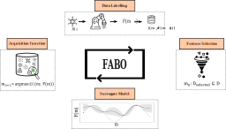

# FABO: Feature-Adaptive Bayesian Optimization Framework

  

## Overview

**FABO (Feature-Adaptive Bayesian Optimization)** is a powerful framework designed to enhance the optimization of material discovery processes by dynamically selecting the most relevant features during each iteration of the optimization process. The framework integrates advanced feature selection techniques, such as **mRMR** and **Spearman ranking**, within the **Bayesian optimization (BO)** loop, reducing data dimensionality and improving the efficiency of BO in high-dimensional search spaces.




This repository provides the code and resources to run FABO on different tasks, such as **CO₂ uptake** and **electronic property optimization** for **MOF discovery**. The framework adapts to the underlying data distributions, offering a more flexible and realistic approach than traditional BO methods that rely on fixed feature sets.

## Key Features

- **Dynamic Feature Selection**: Automatically updates the feature set at each iteration to improve optimization.
- **Flexible Acquisition Strategies**: Supports both **Expected Improvement (EI)** and **Upper Confidence Bound (UCB)**, with the option to switch between them for better exploration and exploitation.
- **Robust Surrogate Model**: Utilizes a **Gaussian Process** as the surrogate model to predict outcomes and quantify uncertainty.
- **Task-agnostic**: Can be applied to a variety of optimization problems, including adsorption and electronic property optimization.
  
## Installation

Clone the repository and install the required dependencies:

```bash
git clone https://github.com/your-username/FABO.git
cd FABO
pip install -r requirements.txt

## Customizing FABO for Your Application

In the second block of the **FABO_main** notebook, you have the flexibility to adjust FABO's parameters to suit your specific optimization needs. Below are the key elements you can modify and what they do:

### Elements of FABO:

- **`nb_iterations`**: The number of iterations for the Bayesian optimization process (default: `250`).  
  - *Usage*: Adjust this to control how long the optimization runs. More iterations can lead to better results, but may require more computational resources.
  
- **`nb_MOFs_initialization`**: The number of initial MOFs selected randomly from the dataset to start the optimization (default: `10`).  
  - *Usage*: Increase or decrease this number to control the size of the initial dataset. Larger initialization may provide better starting points but reduces randomness.

- **`min_features` and `max_features`**: The minimum and maximum number of features to be selected during each feature selection cycle (defaults: `5` and `20` respectively).  
  - *Usage*: Set these to define the feature set size range FABO can work with. A smaller range may make the process faster but could limit exploration of the feature space.

- **`FABO`**: A Boolean flag indicating whether to use the Feature-Adaptive Bayesian Optimization (FABO) method (`True` or `False`).  
  - *Usage*: Set to `True` to enable FABO, or `False` to run a traditional BO without adaptive feature selection.

- **`which_acquisition`**: Determines the acquisition function to be used for selecting the next sample. Options: `"EI"` (Expected Improvement), `"max y_hat"` (exploitation), or `"max sigma"` (exploration).  
  - *Usage*: Choose the acquisition function that fits your task—use `"EI"` for balanced exploration and exploitation, `"max y_hat"` for focusing on the best-known value, or `"max sigma"` for exploring uncertain regions.

- **`FS_method`**: The feature selection method used in FABO. Options include `'spearman'` or `'mRMR'`.  
  - *Usage*: Select the feature selection method to dynamically select the most informative features during the optimization. `'spearman'` is based on rank correlation, while `'mRMR'` balances redundancy and relevance.

- **`n_seed` and `seeds`**: Controls randomness in the optimization process. `n_seed` sets the number of random seeds, and `seeds` generates the list of seeds (default: `19` seeds).  
  - *Usage*: Customize the number of seeds to control the variability in your optimization process.

- **`path`**: The path to the dataset used for the optimization.  
  - *Usage*: Provide the file path to your dataset here. Make sure the dataset is in a CSV format.

- **`label`**: Specifies the target property in your dataset that FABO will optimize (e.g., `"pure_uptake_CO2_298.00_1600000"`).  
  - *Usage*: Replace this with the label of the property you are optimizing in your dataset, such as CO₂ uptake, bandgap, etc.

### Example:

To use FABO for optimizing a new task, modify the following parameters:

- Set `path` to the path of your dataset (e.g., `path = "data/my_dataset.csv"`).
- Adjust `label` to target the property of interest (e.g., `label = "target_property"`).
- Choose the acquisition function (`which_acquisition`) based on whether you want more exploration (`"max sigma"`) or exploitation (`"max y_hat"`).
- Set `min_features` and `max_features` to match the feature set range appropriate for your task.

By personalizing these elements, you can adapt FABO to efficiently optimize your material discovery tasks.
