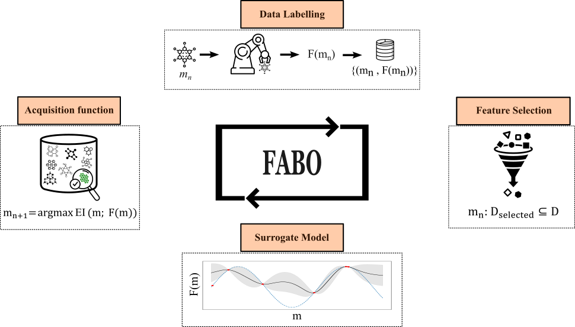

# FABO: Feature-Adaptive Bayesian Optimization Framework

  

## Overview

**FABO (Feature-Adaptive Bayesian Optimization)** is a powerful framework designed to enhance the optimization of material discovery processes by dynamically selecting the most relevant features during each iteration of the optimization process. The framework integrates advanced feature selection techniques, such as **mRMR** and **Spearman ranking**, within the **Bayesian optimization (BO)** loop, reducing data dimensionality and improving the efficiency of BO in high-dimensional search spaces.




This repository provides the code and resources to run FABO on different tasks, such as **CO₂ uptake** and **electronic property optimization** for **MOF discovery**. The framework adapts to the underlying data distributions, offering a more flexible and realistic approach than traditional BO methods that rely on fixed feature sets.

## Key Features

- **Dynamic Feature Selection**: Automatically updates the feature set at each iteration to improve optimization.
- **Flexible Acquisition Strategies**: Supports both **Expected Improvement (EI)** and **Upper Confidence Bound (UCB)**, with the option to switch between them for better exploration and exploitation.
- **Robust Surrogate Model**: Utilizes a **Gaussian Process** as the surrogate model to predict outcomes and quantify uncertainty.
- **Task-agnostic**: Can be applied to a variety of optimization problems, including adsorption and electronic property optimization.
  
## Installation

Clone the repository and install the required dependencies:

```bash
git clone https://github.com/your-username/fabo.git
cd fabo
pip install -r requirements.txt

